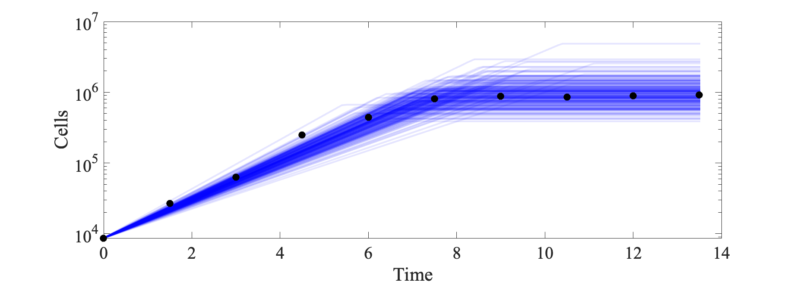
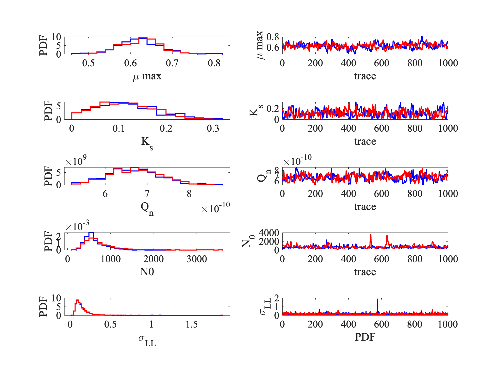

<p align="center">
  <picture>
    
  </picture>
</p>

<h1 align="center"><em>matlab-ode-inference</em>: ODE based Bayesian modeling of dynamics with Matlab</h1>


_matlab-ode-inference_ is a repository to study Biologically inspired dynamical systems with mechanistic models (such as ODEs). Inferring parameters of a mechanistic models involves answering a lot of questions:
- How can we incorporate prior information about parameters and models into our modeling framework?
- How does the choice of the model affect the estimates of the inferred parameters?
- How can we use a Bayesian approach (for example, MCMC type samplers) to model these systems?

We want to compare different methods and techniques on simple _in-silico_ of _experimental_ datasets.

## Installation 📥

First clone the _mcmcstat_ package and add it to Matlab's path. 

```
git clone git@github.com:mjlaine/mcmcstat.git
git clone git@github.com:B2-Bayesian-for-Biology/matlab-ode-inference.git
```

## Getting started

Once you have cloned the repository you can look at a simple example of modeling a growth-curve of cells driven by resources, modeled by an ODE.

[Simple demonstration](./scripts/bayesian_fit_2.m)


<p align="center">
  <picture>
    
  </picture>
</p>

<p align="center">
  <picture>
    
  </picture>
</p>

### Comparing between adaptation steps:
How to tune the adaptation step of a Delayed rejection?
TO DO

### Data transformation/ reparametrization:
- Should the data be log transformed?
- Should some of the parameters be sampled in the log scale?

### FAQ
- Language and implementation: MAtlab -- mcmcstat -- very slow! But transparent!
- ODE solver: ode45.
- Error Model: inv-gamma; assumped independence of points, multiplicative likelihood, compared log(data)  with log(model)
- Convergence tests: Gelman rubin, Autocorrelation of chains, geweke.
- Post processing: burn = 3000 -- need burning for DRAM-MCMC, need atleast 10 chain thinning for.


## Review:
Here's the convention we used (for now).
-  Initial condition fixed from data for P0 and varied for N0 
- flags: Logtransformed = 1 means log(Data) and log(model) compared.
- flags: Logprior = 1, LogNormal Priors used for N0 and Qs
- You can find chains saved in [results](./results/)
- You can find plots saved in [figures](./figures/)

## Contributions.
- Current contributions by [Raunak Dey](https://sites.google.com/view/raunak-dey/home) at UMD.
- Part of the big-project led by [David Talmy](https://eeb.utk.edu/people/david-talmy/) at UTK.
- Please feel free to reach out to me at my [email](mailto:rdey@umd.com?subject=[matlab-bayesian-ode-github])
